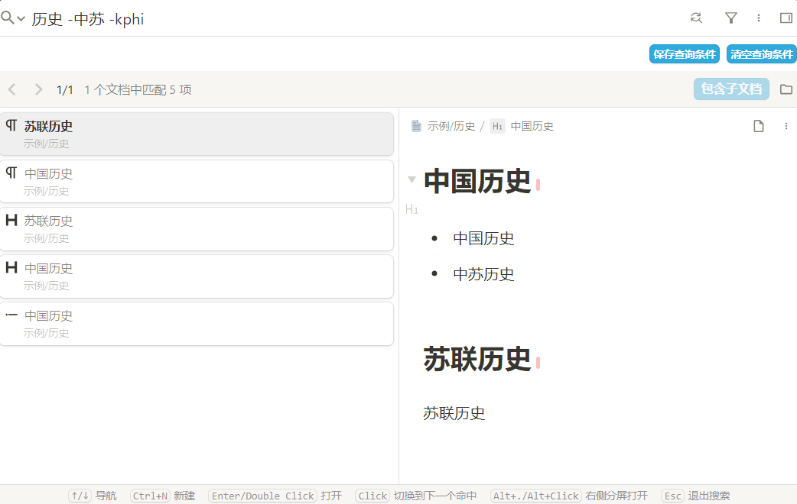
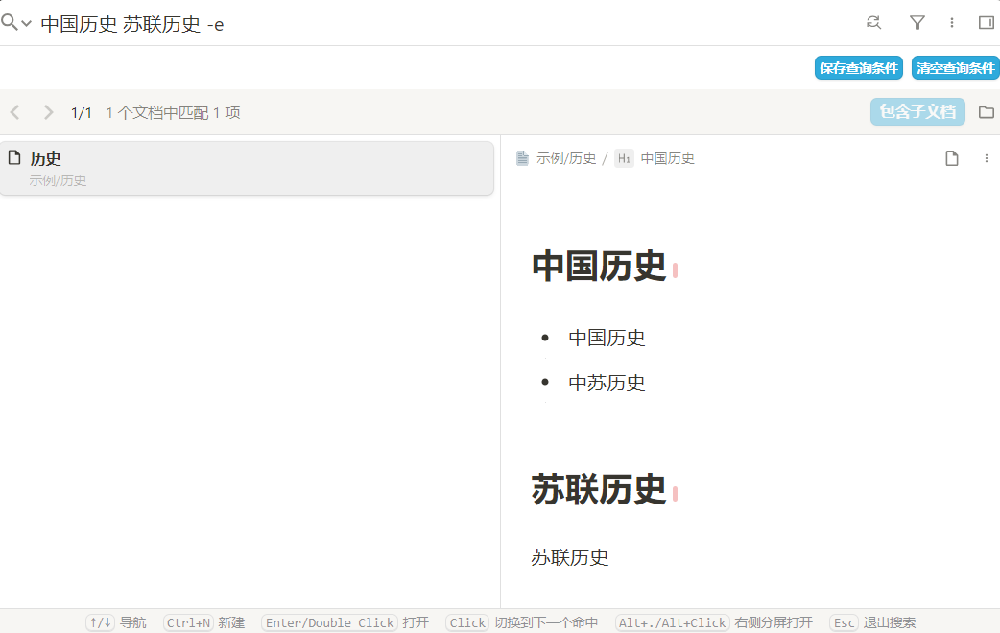

### 写在前面
* 本插件是在 [简易搜索v0.2.2](https://github.com/choyy/simple-search) 的基础上进行魔改, 使用方法与原插件相同
* 因此 如果你想捐赠, 请联系[原插件作者(chooyy)](https://github.com/choyy)或[点击这里捐赠](https://afdian.com/a/chooyy), 而不是我
* 如果有bug, 请在链滴社区联系我([EmberSky](https://ld246.com/member/EmberSky)), 或者提[issue](https://github.com/Ember-Sky/siyuan-plugin-simple-search-plus/issues)(我不常看)
* 写给chooyy大佬: 侵删

### 非常重要 ! ! !
1. 本插件与 简易搜索插件互斥, 如果要使用本插件, **一定要卸载简易搜索插件, 就算关闭开关也不行**
2. 只适配了windows的全局搜索, 如果感觉不好用, 请换回原插件
3. 如果发现搜索页面有问题, 重启下思源试试, 如果还不行, 请换回原插件

### 具体修改内容如下
* \[bug]: 搜索历史偶尔会出现sql语句

  原因: 启动搜索的时候, 会将原搜索框焦点挪到新搜索框上, 触发了原搜索框的blur事件, 会将原搜索框里的内容保存到历史记录里面, 如果是原搜索框里面是sql语句就会这样

  解决: 监听原搜索框的blur事件, 如果原搜索框的内容在历史记录里面, 就将历史记录里面的内容替换成新搜索框的内容

* \[bug]: 点击搜索历史不管用

  原因: 点击搜索历史, 是将搜索内容放到 原搜索框里面, 没有处理新搜索框

  解决: 监听搜索事件, 如果原搜索框的内容 在历史记录里面, 就复制到新搜索框, 重新触发搜索事件

* \[bug]: 使用保存好的查询条件(没有搜索词), 无法查询

  原因: 点击查询条件之后, 修改了查询方式, 插件没有修改对应标记, 查询方式不一致导致查不出来

  解决: 监听搜索事件, 如果当前查询方式与插件不一致, 强制修改成插件的查询方式

* \[修改] 如果按照文档分组, 搜索结果的文档名不高亮
  
  原有效果: 文档名高亮

* \[修改] 搜索结果按照此规则排序: 笔记本id升序+路径名称升序+更新时间降序

  原有效果: 只按照更新时间降序

* \[修改] 优化 搜索指定等级标题块的方式, 例:指定h2或h3 `-h23 关键词` 或 `-h2h3`
  
  原有效果: `-h23 关键词` 是搜索 标题 或 2级 或 3级, `-23 关键词` 才是搜索2级或3级

* \[增加]: 点击 "清空查询条件" 按钮时, 清空新搜索框内容

* \[增加]: 如果有指定路径, 只搜索指定路径下的文档

  方案: 默认的指定路径是这个: `window.siyuan.storage['local-searchdata'].idPath`, 修改指定路径后, 会触发input-search事件 事件回调参数(cfg)里面有路径: `cfg.detail.config.idPath`

* \[增加]: 支持 `-a` 不过滤路径(搜索全部文档)

* \[增加]: 在搜索页面 增加支持 显示/隐藏原搜索框 按钮, 可以控制 是否显示 原搜索框和查询方式, 方便查看实际生效内容

  

* \[增加]: 未搜到结果时, 回车不创建文档, 点击创建文档

**待处理(画饼)**
> 大概率不会处理

* 搜索页面, 增加插件开关
* 增加支持设置页面

### 已知问题(无法/不想处理)

* bug: 修改指定路径或其他个别情况, 会闪一下

  原因: 修改路径, 清空, 点击查询条件 思源本身都会直接搜索一下, 然后插件判断某些地方与期望不符, 就会修改条件, 重新触发搜索, 两次搜索在效果上就是会闪一下

  暂时没有方案解决

* bug: 点击 保存的 使用插件搜索的查询条件, 实际上会生效, 但是新搜索框不会更新
  原因: 点击保存按钮时, 不会处理新搜索框, 所以新搜索框也不好通过原搜索框的内容逆向解析出内容

  解决起来比较麻烦, 暂时不想处理

### 更新日志
### [2025/04/14_13:10:09] release v0.2.5
* [修复] 刷新/重启思源后, 第一次打开全局搜索, 搜索内容会变成上次原搜索框的内容(sql语句)
* [修改] 适配 原插件 到v0.2.5

### [2025/04/10_13:03:31] release v0.2.2
* [basic] 在 简易搜索v0.2.2 的基础上进行魔改

------
下面是原readme

本插件旨在为常用的搜索操作提供简单快捷的搜索方法，主要功能包括：搜索类型过滤、关键词排除、在当前文档搜索以及搜索范围扩展。

**搜索选项汇总：**

- 块类型过滤
  - `d` 文档块（仅在文档名上搜索，不会搜索文档包含内容块）
  - `h` 标题块（仅在标题名上搜索，不会搜索标题块下方内容块）
    - `h`+`数字1-6` 指定标题等级，如 `h123`表示搜索 1、2、3 级标题
  - `l` 列表块（包含有序列表块、无序列表块和任务列表块）
  - `i` 列表项块
  - `c` 代码块
  - `m` 数学公式块
  - `t` 表格块
  - `b` 引述块
  - `s` 超级块
  - `p` 段落块
  - `o` 未完成的待办项(todo)，`O` 已完成的待办项
  - `L` 表示带有链接的块（非思源标准的块类型）
- 关键词排除
  - `-`+`要排除的关键词`，排除指定关键词
- `-k`（current） 在当前文档搜索
  - `-K`可在当前文档及子文档搜索
- `-e`（extension）扩展搜索

# 1. 搜索类型过滤

当使用关键词搜索时如何快速过滤想要的块类型？

搜索时在关键词后输入`-`+`块类型`即可在搜索结果中过滤指定类型的块。

例如，使用`历史 -dhi`即可搜索包含`历史`的文档块(`d`)、标题块(`h`)以及列表项块(`i`)，同时搜索结果会按照输入的块类型排序，如上述搜索会按照文档块(`d`)、标题块(`h`)以及列表项块(`i`)的顺序排序。

常用的块类型有：

- `d` 文档块（仅在文档名上搜索，不会搜索文档包含内容块）
- `h` 标题块（仅在标题名上搜索，不会搜索标题块下方内容块）
    - `h`+`数字1-6` 指定标题等级，如`h123`表示搜索 1、2、3 级标题
- `l` 列表块（包含有序列表块、无序列表块和任务列表块）
- `i` 列表项块
- `c` 代码块
- `m` 数学公式块
- `t` 表格块
- `b` 引述块
- `s` 超级块
- `p` 段落块
- `o` 未完成的待办项(todo)，`O` 已完成的待办项
- `L` 表示带有链接的块，非思源标准的块类型

# 2. 关键词排除

在搜索时如何快速排除不想要的关键词？

搜索时在关键词后输入`-`+`要排除的关键词`即可搜索关键词并排除指定关键词，并且关键词排除与搜索类型过滤可搭配使用。

例如，使用`历史 -中苏 -dhi`即可搜索包含`历史`但不包含`中苏`的文档块(`d`)、标题块(`h`)以及列表项块(`i`)，同时搜索结果会按照输入的块类型排序。支持排除多个关键词，只需继续输入`-`+`要排除的关键词`即可。

# 3. 在当前文档（子文档）搜索

在当前文档搜索除了使用 `Ctrl+F` 还能怎么做？

搜索时在关键词后输入`-k`（current）即可在当前文档搜索。
搜索时在关键词后输入`-K`可在当前文档及子文档搜索。同样的，`-k`和`-K`可以与搜索类型过滤、关键词排除结合使用。

例如，使用`历史 -中苏 -kphi`即可在当前文档中搜索包含`历史`但不包含`中苏`的段落块(`p`)、标题块(`h`)以及列表项块(`i`)，同时搜索结果会按照输入的块类型排序。

# 4. 搜索范围扩展

当想要搜索同时包含`中国历史`和`苏联历史`的文档而这两个关键词又不在一个块内该怎么办？

搜索时在关键词后输入`-e`（extension）即可搜索同时包含`中国历史`和`苏联历史`的文档，注意`-e`不可与搜索类型过滤、当前文档搜索结合使用。

# 5. 使用默认搜索方法

在使用本插件后，默认的搜索方法已被本插件屏蔽，那么如果想要使用默认的搜索方法该怎么办？

在搜索时使用 `-+搜索方法+搜索关键词`即可使用默认的搜索方法进行搜索。默认搜索方法分别为：

- `w`（keywords）关键字
- `q`（query syntax）查询语法
- `s`（SQL）SQL语句搜索
- `r`（regex）正则表达式

比如使用`-q中国历史 NOT 苏联`即可使用查询语法搜索`中国历史 NOT 苏联`，使用`-s + SQL语句`即可使用SQL搜索。

# 6. 反馈与建议

可在[【插件】简易搜索 - 更高效的搜索方式 - 链滴](https://ld246.com/article/1689344075636)或[Issues · choyy/simple-search](https://github.com/choyy/simple-search/issues)或某QQ群提交反馈或建议。

# 7. 更新日志

- v0.2.2，**未指定搜索类型时应选择设置中启用的块类型**
- v0.2.1，修复bug
- v0.2.0，支持高亮搜索关键词
- v0.1.3，继续修复点击标签搜索问题
- v0.1.2，修复点击标签触发搜索时关键词不为标签的问题
- v0.1.1，扩展搜索时自动按文档分组，适配 2.11.4
- v0.1.0，支持`-[oO]`搜索待办项，支持`-L`搜索带有链接的块
- v0.0.12，适配 2.11.1
- v0.0.10，支持搜索页签，新增`-K`在当前文档及子文档搜索
- v0.0.9，支持搜索子标题
- v0.0.8，扩展范围搜索忽略容器块
- v0.0.7，支持 docker 及浏览器端
- v0.0.6，扩展范围搜索显示到块
- v0.0.5，扩展范围搜索按照修改时间降序排序
- v0.0.4，修复bug
- v0.0.3，修复bug
- v0.0.2，提升扩展范围搜索的搜索速度
- v0.0.1，初版